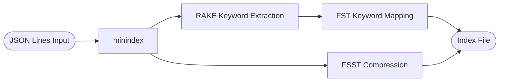

# minindex

[](https://github.com/undo-git-pull/minindex/actions/workflows/ci.yml)

**Minimal, memory-mapped local text indexing for Python**

`minindex` is a lightweight, high-performance text indexing library designed for **local document search** using a Rust backend and memory-mapped data structures.

## Features

* **Memory-mapped indexes** (low RAM overhead for queries)
* **Compressed inverted indexes** (FST + FSST)
* **Two search modes**: fuzzy and regex
* **Local only. No server, no JVM**
* Designed for **small → medium corpora** (10k–10M documents)
* **Indexing loads the full corpus into memory** (plan RAM accordingly)
* **Thread-safe for concurrent read-only queries** (Python calls are serialized by the GIL)

## Installation

```bash
pip install minindex
```

---
# Example Usage

## Index API

```python
from minindex import index_from_jsonl

# Minimal index: index required fields, doc_id defaults to first field.
index_from_jsonl("corpus.jsonl", "index-file.idx", index_fields=["title", "body"])

# Explicit doc_id, plus extra fields to return (not indexed, optional per doc).
index_from_jsonl(
    "corpus.jsonl",
    "index-file.idx",
    index_fields=["title", "body"],
    doc_id_field="title",
    more_fields=["category", "href"],
)

```

## Search API

```python
# For fuzzy search, multiple search terms are treated as AND
results = idx.fuzz_search(
    keywords: str,
    limit: int = 20
)

results = idx.regex_search(
    regex: str,
    limit: int = 20
)
```
---

### Result Object

```python
class SearchResult:
    doc_id: str
    score: float
    matches: list[str]
    document: dict[str, str]  # indexed fields, doc_id, and any more_fields present
```

---

## Index Pipeline



- Indexing reads JSONL, requires `index_fields`, and optionally stores `more_fields`; `doc_id` defaults to the first field when not provided.
- Text is tokenized with a simple alphanumeric splitter; stop words are removed and RAKE keywords are added before building an FST keyword map with posting scores.
- Documents are stored as FSST-compressed string vectors and serialized to a memory-mapped index file.
- `fuzz_search` uses Levenshtein(1) + prefix matches in the FST, ANDs multi-term queries, and scores by summed postings.
- `regex_search` scans the concatenated indexed fields per document and returns up to 16 match strings.

---

**Example corpus (line-separated JSON)**
```
{"title": "New Guidelines for Hypertension Screening", "category": "Medical", "href": "/article/medical/0", "body": "Clinicians are urged to confirm elevated readings with\\ambulatory monitoring before initiating treatment."}
{"title": "Advances in Postoperative Pain Management", "category": "Medical", "href": "/article/medical/1", "body": "A multimodal approach combining regional anesthesia\\and non-opioid analgesics reduces hospital stays." }
```

## License

MIT

## Credits

Inspired by https://github.com/microsoft/docfind
